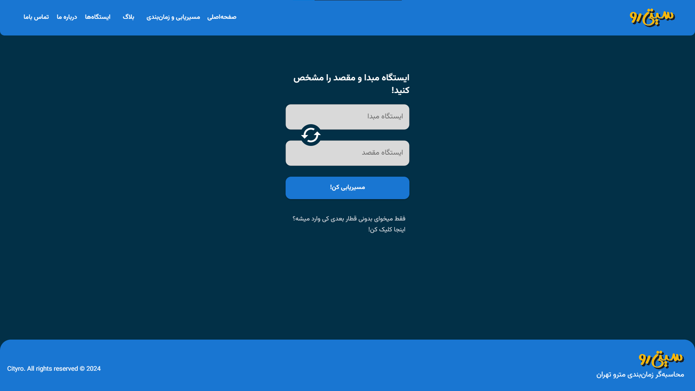
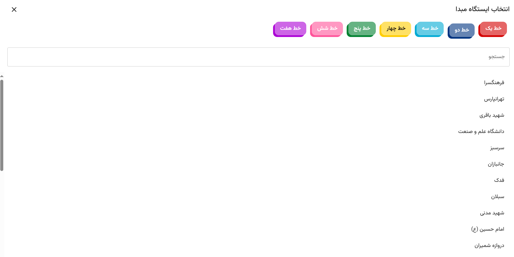
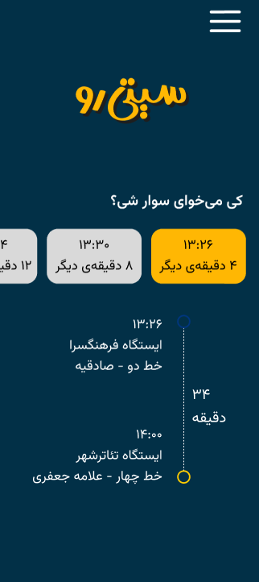

A simple web app for calculating travel time with the subway. Built using NextJS and Material UI for the frontend.

```bash
npm install
# then
npm run dev
```

Special thanks to Mohammadreza Sharify for developing the backend of the project using NodeJS.
Backend repository: https://github.com/VaryoSc/Citydo




